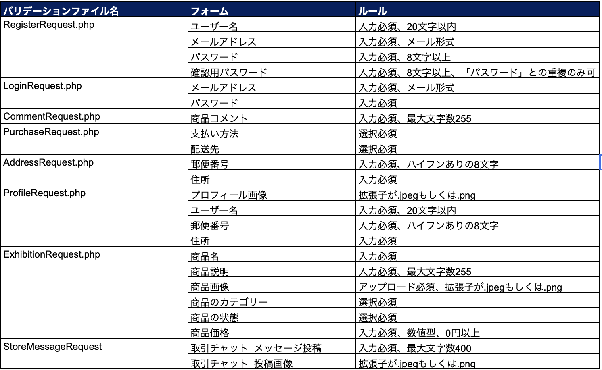
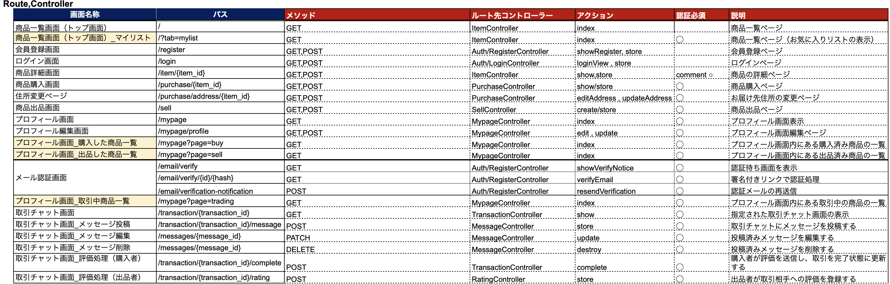
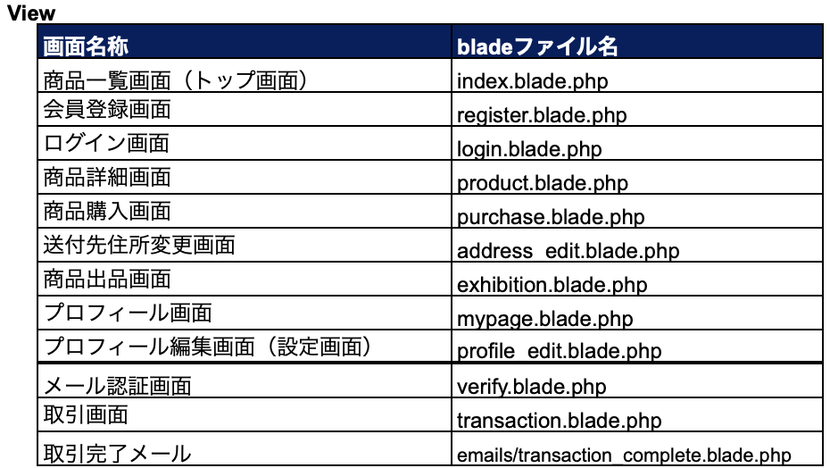

# フリーマーケット

## 環境構築🔗

### Dockerビルド手順

1. `git clone` git@github.com:karun119/freemarket.git
2. `cd freemarket`
3. `docker-compose up -d --build`

> ※MySQLは、OSによって起動しない場合があります。  
> 必要に応じて、ご自身のPC環境に合わせて `docker-compose.yml` ファイルを編集してください。
> ⚠️ 補足（Macユーザー向け）
>
> 本リポジトリでは Mac（M1・M2）での MySQL 起動に対応するため、
> `docker-compose.yml` に以下を記載済みです。
> 
```yaml
mysql:
    platform: linux/x86_64   # ← この行を追加しています
    image: mysql:8.0.26
    environment:
```
>
> そのため、`docker-compose.yml` を直接編集せずに `docker-compose up -d --build` で起動可能です。
---

### Laravel環境構築手順🔗

1. `docker-compose exec php bash`
2. `composer install`
3. `.env.example` から `.env` を作成 
   `cp .env.example .env`
4. `.env`に以下の環境変数を追加してください。
   ```env
   DB_CONNECTION=mysql
   DB_HOST=mysql
   DB_PORT=3306
   DB_DATABASE=laravel_db
   DB_USERNAME=laravel_user
   DB_PASSWORD=laravel_pass
   
5. `php artisan key:generate`
6. `php artisan migrate`
7. `php artisan db:seed`
8. シンボリックリンク作成
   `php artisan storage:link`
   

---

### メールテスト環境（MailHog）　📧

MailHog を使用することで、開発中のメール送信内容をローカルのWeb画面で確認できます。
（実際の送信はされません）

### メール送信設定手順🔗
1. `.env` に以下を追記してください
      ```env
      MAIL_MAILER=smtp  
      MAIL_HOST=mailhog  
      MAIL_PORT=1025  
      MAIL_USERNAME=null  
      MAIL_PASSWORD=null  
      MAIL_ENCRYPTION=null  
      MAIL_FROM_ADDRESS=test@example.com  
      MAIL_FROM_NAME="${APP_NAME}"

2. 設定変更後は以下のコマンドでキャッシュをクリアしてください。

   `php artisan config:clear`

---

## アプリのユーザー情報🔗

> 本アプリには管理者ユーザーは存在しません。  
> ※ 新規出品やマイページの商品未出品状態の確認にはユーザー3をご利用ください。


- ユーザー1  (出品あり 5件）
  email: taro@example.com  
  password: password1  

- ユーザー2  （出品あり 5件）
  email: hanako@example.com  
  password: password2  

- ユーザー3  （出品なし・新規出品テスト用)
  email: jiro@example.com  
  password: password3  

---
## Stripe（テスト環境）

> 本アプリでは、決済機能に Stripe（テスト環境）のみを使用しています。

> 購入ボタン押下後、Stripe 側の決済画面に遷移します。  
支払い方法としてコンビニ支払いを選択した場合は、Stripe のテスト用レシート画面に遷移します。

### 環境変数の設定

Stripe の API キーは、`.env`に以下のように設定してください。
>（ご自身の Stripe アカウントから取得したキーを使用）

```env
STRIPE_PUBLIC_KEY="パブリックキー"
STRIPE_SECRET_KEY="シークレットキー"
```
Stripe 公式ドキュメント
https://docs.stripe.com/payments/checkout?locale=ja-JP

- ※ 本アプリはテスト用実装のため、
Stripe の決済完了可否に関わらず、購入ボタン押下時点で
orders テーブルに購入情報を保存する仕様としています。


---
## PHPUnitを利用したテスト環境の手順🔗
- 本アプリでは、テスト実行時に `.env.testing` を使用します。


1. MySQLコンテナに入る
```bash
docker-compose exec mysql bash
```
2. MySQLにログイン
```bash  
mysql -u root -p
```
>パスワードは「root」と入力
3. テスト用データベースを作成
```bash
create database demo_test;
```
4. 作成できたか確認する
```bash
SHOW DATABASES;
```
 >実行すると、MySQLにあるデータベースの一覧が表示されます。
 >その中に demo_test があれば作成成功です。

5.コンテナから退出
```bash
exit
```
6.もう一度
```bash
exit
```
7.PHPコンテナに入ります

```bash
docker-compose exec php bash
```

### テスト環境用のマイグレーションを実行

```bash
php artisan migrate:fresh --env=testing
```

>⚠️migrate:fresh を実行すると、テスト用データベース内のデータが すべて削除されます。ブラウザで
ログイン確認などを行う場合は、初期データが必要なため 以下のseed をつけて実行してください。
>
```bash
php artisan migrate:fresh --env=testing --seed
```

### テストを実行

Laravel コマンドで実行する場合：

```bash
php artisan test
```


### 補足

- テスト設定は `phpunit.xml` に記述されています。    

---

## チャット機能概要について

### メッセージ送信
- フォーム送信時も下部表示を保持（メッセージ確認のため）

### メッセージ編集
- 「編集」ボタンで表示モードから編集フォームに切替
- 編集中は「保存」「キャンセル」ボタンを表示
- 保存後は「編集済み」と表示され、メッセージは最新順で下部に移動

### 編集メッセージの通知
- メッセージの編集では相手への新規通知は送信されません
- 理由：既存メッセージの修正であり、通知が毎回飛ぶとユーザー体験が煩雑になるため

---

## 取引画面サイドバーの"その他の取引"の仕様（出品者）

- **並び順**：新規メッセージがある取引順（最新メッセージが上）  
  - **理由**：新しいやり取りが一目で分かるようにするため
- **完了済みの取引はサイドバーに表示しない**  
  - **理由**：終わっていない取引をまとめて見やすくするため
---

## バリデーション一覧

### メッセージ編集
- 今回はバリデーション未設定（機能要件に記載がなかったため）  
  → 空欄送信でもDBは更新されず、既存メッセージは維持されます

### 取引評価
- 今回はバリデーション未設定（機能要件に記載がなかったため）  
  → コントローラとJSでエラーメッセージを表示する仕様にしています

---
## 使用技術🔗

- Laravel: 8.83.29 
- PHP: 8.1.33  
- Composer: 2.8.10  
- MySQL: 8.0.26  
- Nginx: 1.21.1  
- [phpMyAdmin（http://localhost:8080）](http://localhost:8080)
- [MailHog　(http://localhost:8025) ](http://localhost:8025) 
- Docker / Docker Compose

---

## ER図🔗


---
## テーブル仕様書
### usersテーブル
| カラム名              | 型               | PRIMARY KEY | UNIQUE KEY | NOT NULL | FOREIGN KEY |
| ----------------- | --------------- | ----------- | ---------- | -------- | ----------- |
| id                | unsigned bigint | ○           |            | ○        |             |
| name              | varchar(255)    |             |            | ○        |             |
| email             | varchar(255)    |             | ○          | ○        |             |
| password          | varchar(255)    |             |            | ○        |             |
| email_verified_at | timestamp       |             |            |          |             |
| remember_token    | varchar(100)    |             |            |          |             |
| created_at        | timestamp       |             |            |          |             |
| updated_at        | timestamp       |             |            |          |             |

### profilesテーブル
| カラム名        | 型               | PRIMARY KEY | UNIQUE KEY | NOT NULL | FOREIGN KEY |
| ----------- | --------------- | ----------- | ---------- | -------- | ----------- |
| id          | unsigned bigint | ○           |            | ○        |             |
| user_id     | unsigned bigint |             |            | ○        | users(id)   |
| image_path  | varchar(255)    |             |            |          |             |
| postal_code | varchar(255)    |             |            | ○        |             |
| address     | varchar(255)    |             |            | ○        |             |
| building    | varchar(255)    |             |            |          |             |
| created_at  | timestamp       |             |            |          |             |
| updated_at  | timestamp       |             |            |          |             |

### categoriesテーブル
| カラム名       | 型               | PRIMARY KEY | UNIQUE KEY | NOT NULL | FOREIGN KEY |
| ---------- | --------------- | ----------- | ---------- | -------- | ----------- |
| id         | unsigned bigint | ○           |            | ○        |             |
| category   | varchar(255)    |             |            | ○        |             |
| created_at | timestamp       |             |            |          |             |
| updated_at | timestamp       |             |            |          |             |

### conditionsテーブル
| カラム名       | 型               | PRIMARY KEY | UNIQUE KEY | NOT NULL | FOREIGN KEY |
| ---------- | --------------- | ----------- | ---------- | -------- | ----------- |
| id         | unsigned bigint | ○           |            | ○        |             |
| name       | varchar(255)    |             |            | ○        |             |
| created_at | timestamp       |             |            |          |             |
| updated_at | timestamp       |             |            |          |             |

### productsテーブル
| カラム名         | 型                | PRIMARY KEY | UNIQUE KEY | NOT NULL | FOREIGN KEY    |
| ------------ | ---------------- | ----------- | ---------- | -------- | -------------- |
| id           | unsigned bigint  | ○           |            | ○        |                |
| user_id      | unsigned bigint  |             |            | ○        | users(id)      |
| condition_id | unsigned bigint  |             |            | ○        | conditions(id) |
| item_name    | varchar(255)     |             |            | ○        |                |
| image_path   | varchar(255)     |             |            | ○        |                |
| brand        | varchar(255)     |             |            |          |                |
| description  | varchar(255)     |             |            | ○        |                |
| price        | unsigned integer |             |            | ○        |                |
| created_at   | timestamp        |             |            |          |                |
| updated_at   | timestamp        |             |            |          |                |

### category_productテーブル（中間テーブル）
| カラム名        | 型               | PRIMARY KEY | UNIQUE KEY      | NOT NULL | FOREIGN KEY    |
| ----------- | --------------- | ----------- | --------------- | -------- | -------------- |
| category_id | unsigned bigint |             | product_idとの複合  | ○        | categories(id) |
| product_id  | unsigned bigint |             | category_idとの複合 | ○        | products(id)   |
| created_at  | timestamp       |             |                 |          |                |
| updated_at  | timestamp       |             |                 |          |                |

### ordersテーブル
| カラム名             | 型               | PRIMARY KEY | UNIQUE KEY | NOT NULL | FOREIGN KEY  |
| ---------------- | --------------- | ----------- | ---------- | -------- | ------------ |
| id               | unsigned bigint | ○           |            | ○        |              |
| user_id          | unsigned bigint |             |            | ○        | users(id)    |
| product_id       | unsigned bigint |             |            | ○        | products(id) |
| sending_postcode | varchar(255)    |             |            | ○        |              |
| sending_address  | varchar(255)    |             |            | ○        |              |
| sending_building | varchar(255)    |             |            |          |              |
| payment_method   | varchar(255)    |             |            | ○        |              |
| created_at       | timestamp       |             |            |          |              |
| updated_at       | timestamp       |             |            |          |              |

### favoritesテーブル（中間テーブル）
| カラム名       | 型               | PRIMARY KEY | UNIQUE KEY     | NOT NULL | FOREIGN KEY  |
| ---------- | --------------- | ----------- | -------------- | -------- | ------------ |
| user_id    | unsigned bigint |             | product_idとの複合 | ○        | users(id)    |
| product_id | unsigned bigint |             | user_idとの複合    | ○        | products(id) |
| created_at | timestamp       |             |                |          |              |
| updated_at | timestamp       |             |                |          |              |

### commentsテーブル
| カラム名       | 型               | PRIMARY KEY | UNIQUE KEY | NOT NULL | FOREIGN KEY  |
| ---------- | --------------- | ----------- | ---------- | -------- | ------------ |
| id         | unsigned bigint | ○           |            | ○        |              |
| user_id    | unsigned bigint |             |            | ○        | users(id)    |
| product_id | unsigned bigint |             |            | ○        | products(id) |
| comment    | varchar(255)    |             |            | ○        |              |
| created_at | timestamp       |             |            |          |              |
| updated_at | timestamp       |             |            |          |              |

### transactionsテーブル（取引管理）
| カラム名       | 型               | PK | UNIQUE | NOT NULL | FK         |
| ---------- | --------------- | -- | ------ | -------- | ---------- |
| id         | unsigned bigint | ⚪︎ |        | ⚪︎       |            |
| order_id   | unsigned bigint |    |        | ⚪︎       | orders(id) |
| seller_id  | unsigned bigint |    |        | ⚪︎       | users(id)  |
| status     | enum     |    |        | ⚪︎       |            |
| created_at | timestamp       |    |        |          |            |
| updated_at | timestamp       |    |        |          |            |

transactionsテーブル補足：
- statusは「trading（取引中）」「completed（取引完了）」のいずれかを格納する。

### messagesテーブル（取引チャット）
| カラム名           | 型               | PK | UNIQUE | NOT NULL | FK               |
| -------------- | --------------- | -- | ------ | -------- | ---------------- |
| id             | unsigned bigint | ⚪︎ |        | ⚪︎       |                  |
| transaction_id | unsigned bigint |    |        | ⚪︎       | transactions(id) |
| user_id        | unsigned bigint |    |        | ⚪︎       | users(id)        |
| content        | text            |    |        | ⚪︎       |                  |
| image_path     | varchar(255)    |    |        |          |                  |
| read_at        | timestamp       |    |        |          |                  |
| edited_at      | timestamp       |    |        |          |                  |
| created_at     | timestamp       |    |        |          |                  |
| updated_at     | timestamp       |    |        |          |                  |

messagesテーブル補足：
- read_atカラムは　NULL=未読、日時あり=既読

### ratingsテーブル（評価）
| カラム名           | 型                | PK | UNIQUE | NOT NULL | FK               |
| -------------- | ---------------- | -- | ------ | -------- | ---------------- |
| id             | unsigned bigint  | ⚪︎ |        | ⚪︎       |                  |
| transaction_id | unsigned bigint  |    | ⚪︎（複合） | ⚪︎       | transactions(id) |
| rater_id       | unsigned bigint  |    | ⚪︎（複合） | ⚪︎       | users(id)        |
| rated_user_id  | unsigned bigint  |    |        | ⚪︎       | users(id)        |
| score          | unsigned integer |    |        | ⚪︎       |                  |

ratingsテーブル補足：
- 1取引につき、1ユーザーは1回のみ評価できる仕様とするため
(transaction_id, rater_id) にUNIQUE制約を設定

---
## 画面仕様書
### 仕様書


### 詳細画面


---
## URL🔗

- [開発環境 : http://localhost/](http://localhost/)
- [phpMyAdmin : http://localhost:8080/](http://localhost:8080/)
